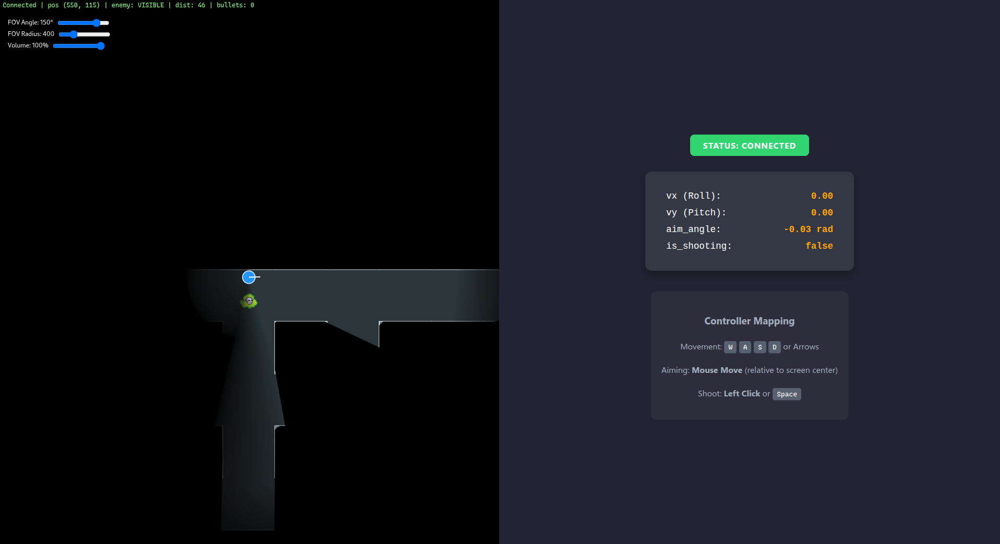
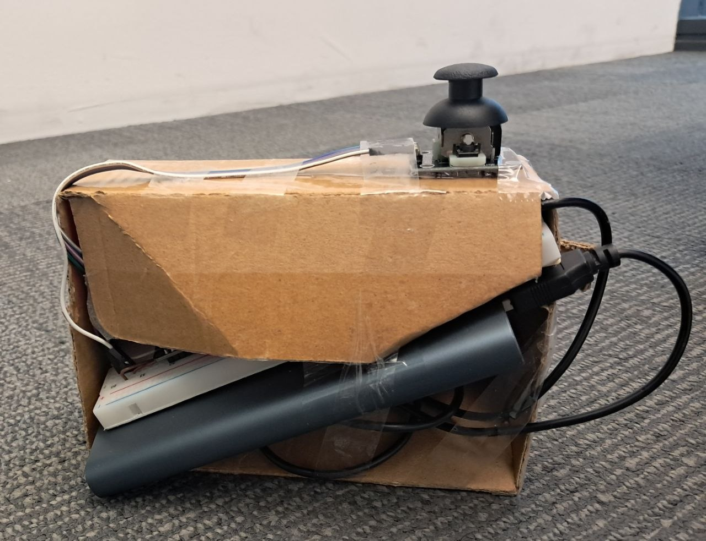

# Deadline Escape (Escape from Shadow)

An interactive, IoT-based survival top-down shooter. The player uses a custom ESP32 controller-or a browser mock-to navigate a procedurally generated maze in near-total darkness, stun a pursuing shadow with a flashlight beam, and reach the exit before being caught.

* **Course:** Embedded Systems - CE4621
* **Professor:** Dr. Ansari
* **Semester / Year:** Spring 2026

## Team Members

| Name | Student ID | GitHub Profile |
| :--- | :--- | :--- |
| MohammadAmin Koohi | 402106401 | [@mohammadaminkoohi](https://github.com/mohammadaminkoohi) |
| AmirHossein MohammadZadeh | 402106434 | [@ahmz1833](https://github.com/ahmz1833) |
| SeyedAhmad MousaviAval | 402106648 | [@seyedahmadmosaviawal](https://github.com/seyedahmadmosaviawal) |

---

## How It Works

1. The **controller** (ESP32 or mock page) sends movement, aim, and shoot input over WebSocket.
2. The **server** runs all game logic-physics, collisions, enemy AI, and line-of-sight culling-and broadcasts state to viewers at 10 Hz.
3. The **client** renders the authoritative state with a follow camera, flashlight cone, and distance-based audio.

**Objective:** Reach the green exit tile without touching the shadow. Shoot to stun the enemy for 2 seconds and buy time. Press shoot once while waiting to start a new run.



---

## Project Architecture

The project uses an **authoritative server** model: the client never simulates physics, which keeps bandwidth low and gameplay consistent.

| Component | Path | Role |
| :--- | :--- | :--- |
| Hardware controller | [`esp32/`](esp32/) | Reads MPU-6050 tilt (movement) and analog joystick (aim/shoot); streams JSON input at **8 Hz** |
| Mock controller | [`esp32/mock.html`](esp32/mock.html) | Keyboard/mouse stand-in for development without hardware (~5 Hz) |
| Game server | [`server/`](server/) | Node.js + WebSocket engine on port **8080** - 30 Hz physics, 10 Hz broadcast, A\* pathfinding, FOV culling |
| Thin client | [`client/`](client/) | HTML5 Canvas renderer with flashlight effect and adaptive audio |

```
┌─────────────┐     WebSocket      ┌──────────────┐     WebSocket      ┌─────────────┐
│ ESP32 or    │ ─────────────────► │ Node.js      │ ◄───────────────── │ client.html │
│ mock.html   │   input @ 5–8 Hz   │ server.js    │   state @ 10 Hz    │  (viewer)   │
└─────────────┘                    └──────────────┘                    └─────────────┘
```

### Server highlights

- **World:** 2100×2100 px maze (21×21 cells, 100 px each), generated with recursive backtracking
- **Entities:** Player (r=15), shadow enemy (r=20), bullets (r=3)
- **Enemy AI:** A\* pathfinding with direct chase when close; stunned on bullet hit
- **FOV culling:** Enemy position is omitted from updates unless visible in the player's cone or base light radius and not blocked by walls

### Client highlights

- Follow camera keeps the player centered on screen
- Flashlight cone (default **150°**, adjustable 30°–180° in the UI)
- Adaptive audio: enemy proximity drives will-o'-wisp and footstep volume

---

## Getting Started

### Prerequisites

- [Node.js](https://nodejs.org/) v14 or newer
- A modern browser (Chrome, Firefox, Edge)
- **For hardware:** ESP32 board, MPU-6050, analog joystick, Arduino IDE or PlatformIO

### 1. Start the server

```bash
cd server
npm install
npm start
```

The server listens on **port 8080** and logs when the maze is ready.

### 2. Open the game client

Open [`client/client.html`](client/client.html) in your browser (double-click or serve the `client/` folder with any static file server).

Click anywhere on the overlay to enable audio and connect. The status indicator in the top-left should show **Connected**.

### 3. Connect a controller

**Option A - Mock (no hardware):**

Open [`esp32/mock.html`](esp32/mock.html) in another browser tab on the same machine.

| Input | Action |
| :--- | :--- |
| `W` / `A` / `S` / `D` or arrow keys | Move |
| Mouse | Aim (relative to screen center) |
| Left click or `Space` | Shoot |

**Option B - ESP32 hardware:**



1. Install Arduino libraries: **ArduinoJson**, **WebSocketsClient** (by Links2004)
2. Open [`esp32/esp32.ino`](esp32/esp32.ino) and set your WiFi credentials and the server IP:

   ```cpp
   constexpr char WIFI_SSID[] = "your-ssid";
   constexpr char WIFI_PASSWORD[] = "your-password";
   constexpr char SERVER_IP[] = "192.168.x.x";  // LAN IP of the machine running server.js
   ```

3. Wire the hardware:

   | Device | Connection |
   | :--- | :--- |
   | MPU-6050 | SDA pin 21, SCL pin 22 |
   | Joystick VRx | GPIO 34 |
   | Joystick VRy | GPIO 35 |
   | Joystick button | GPIO 32 (internal pull-up) |

4. Flash the sketch to the ESP32. Tilt the board to move; use the joystick to aim and shoot.

> **Note:** The ESP32 must reach the server over your local network. Use the host machine's LAN address, not `localhost`.

---

## Repository Layout

```
DeadlineEscape/
├── client/
│   └── client.html          # Game viewer (Canvas + WebSocket)
├── esp32/
│   ├── esp32.ino            # ESP32 firmware
│   └── mock.html            # Browser-based controller simulator
├── server/
│   ├── server.js            # Authoritative game server
│   └── package.json
└── README.md
```

---

*Developed as a course project.*
